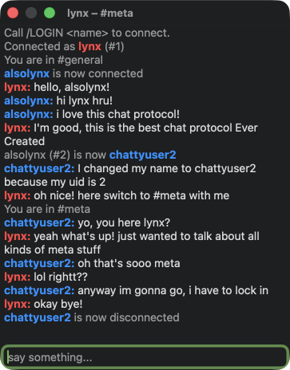

chatty
======

an instant messaging protocol & reference implementations in Swift and Rust

(just for fun)

- `cargo run` (Run server)
- `swift run` (Run desktop client app)
- `make Chatty.app` (Build desktop client app)



## Protocol Syntax

```
-- Server Event
VERB  (Space PARAMETER)... Newline

	MSG in:general from:lynx uid:2 :Hello, world! :D
	^v. ^param.    ^param.   ^p.   ^param. (greedy)

	NAME _:newlynx was:lynx uid:2
	^v.  ^param.   ^param.  ^p.

-- Server Message
VERB! (Space code:CODE)? Space MESSAGE Newline

	WELCOME! Call /LOGIN <name> to connect.
	^verb    ^message

	ERROR! code:4307 Call /LOGIN <name> to connect.
	^verb  ^code     ^message

-- Client Command
/VERB (Space PARAMETER)... Newline

	/LOGIN lynx
	^verb  ^p.
	
	/SWITCH to:general
	^verb   ^param.
	
	/SEND to:general :This is an awesome message
	^verb ^param.    ^param. (greedy)

```
